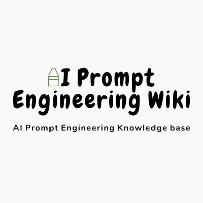

# AI 提示工程入门

我最近在系统的学习提示工程，总结了一下笔记，也写一个“AI 提示工程入门”，供新手们使用，每周更新 1-3 讲。

路线图根据本仓库 star 数量来定：

- [x] 2 :star: 发布官网: [ai-prompt-engineering.wiki](http://ai-prompt-engineering.wiki/)

- [] 32 :star: 建立社群

- [] 128 :star: 出进阶内容

- [] 1024 :star: 发课程认证`SBT`

- [] 2048 :star: 发社群 NFT

## 一、前言

**1. 目标读者** [文章](https://github.com/AI-Prompt-Engineering-Wiki/ai-prompt-tutorial/blob/master/docs/tutorial/0_preface/0-1_target-audience.md)
**2. 内容概述** [文章](https://github.com/AI-Prompt-Engineering-Wiki/ai-prompt-tutorial/blob/master/docs/tutorial/0_preface/0-2_content-overview.md)
**3. 练习作者** [文章](https://github.com/AI-Prompt-Engineering-Wiki/ai-prompt-tutorial/blob/master/docs/tutorial/0_preface/0-3_contact-author.md)

## 二、介绍

**1. AI 大模型的运行逻辑** [文章](https://github.com/AI-Prompt-Engineering-Wiki/ai-prompt-tutorial/blob/master/docs/tutorial/1_introduction/1-1_operational-logic-of-ai.md)
**2. 什么是 Prompt Engineering** [文章](https://github.com/AI-Prompt-Engineering-Wiki/ai-prompt-tutorial/blob/master/docs/tutorial/1_introduction/1-2_what-is-ai-prompt.md)
**3. 为什么需要 Prompt Engineering** [文章](https://github.com/AI-Prompt-Engineering-Wiki/ai-prompt-tutorial/blob/master/docs/tutorial/1_introduction/1-3_why-do-i-need-ai-prompt.md)
**4. 应用场景** [文章](https://github.com/AI-Prompt-Engineering-Wiki/ai-prompt-tutorial/blob/master/docs/tutorial/1_introduction/1-4_application-scenarios.md)

## 三、基础知识

**1. 基本概念与术语** [文章](https://github.com/AI-Prompt-Engineering-Wiki/ai-prompt-tutorial/blob/master/docs/tutorial/2_basic-knowledge/2-1_basic-concepts-and-terminology.md)
**2. 设计模式** [文章](https://github.com/AI-Prompt-Engineering-Wiki/ai-prompt-tutorial/blob/master/docs/tutorial/2_basic-knowledge/2-2_design-patterns.md)

## 四、语法与结构

**1. 语法与结构概述** [文章](https://github.com/AI-Prompt-Engineering-Wiki/ai-prompt-tutorial/blob/master/docs/tutorial/3_grammar-and-structure/3-1_grammar-and-structure-overview.md)
**2. 常见规则与限制** [文章](https://github.com/AI-Prompt-Engineering-Wiki/ai-prompt-tutorial/blob/master/docs/tutorial/3_grammar-and-structure/3-2_common-rules-and-limitations.md)

## 五、设计与优化

### 1. 如何设计好的 Prompt

**1. ChatGPT** [文章](https://github.com/AI-Prompt-Engineering-Wiki/ai-prompt-tutorial/blob/master/docs/tutorial/4_design-and-optimization/4-1_how-to-design-a-good-ai-prompt/4-1-1_chatgpt.md)
**2. StableDiffusion** [文章](https://github.com/AI-Prompt-Engineering-Wiki/ai-prompt-tutorial/blob/master/docs/tutorial/4_design-and-optimization/4-1_how-to-design-a-good-ai-prompt/4-1-2_stable-diffusion.md)
**3. Midjourney** [文章](https://github.com/AI-Prompt-Engineering-Wiki/ai-prompt-tutorial/blob/master/docs/tutorial/4_design-and-optimization/4-1_how-to-design-a-good-ai-prompt/4-1-3_midjourney.md)

**2. 优化 Prompt 的方法与技巧** [文章](https://github.com/AI-Prompt-Engineering-Wiki/ai-prompt-tutorial/blob/master/docs/tutorial/4_design-and-optimization/4-2_methods-and-techniques-for-optimizing-ai-prompt.md)

## 六、高级应用

**1. 论文去重** [文章](https://github.com/AI-Prompt-Engineering-Wiki/ai-prompt-tutorial/blob/master/docs/tutorial/5_advance_case/5-1_paper-remove-duplicates.md)

## 七、推荐工具

TODO

## 八、未来发展

**1. 未来趋势与展望** [文章](https://github.com/AI-Prompt-Engineering-Wiki/ai-prompt-tutorial/blob/master/docs/tutorial/7_future-development/7-1_future-trends-and-prospects.md)
**2. 创新应用与发展方向** [文章](https://github.com/AI-Prompt-Engineering-Wiki/ai-prompt-tutorial/blob/master/docs/tutorial/7_future-development/7-2_innovative-application-and-development-direction.md)
