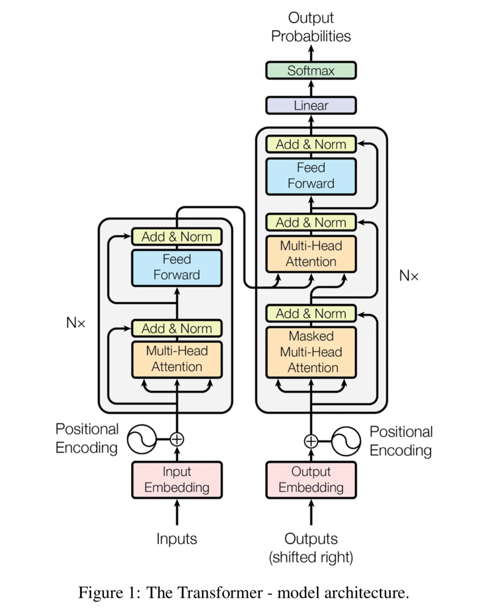
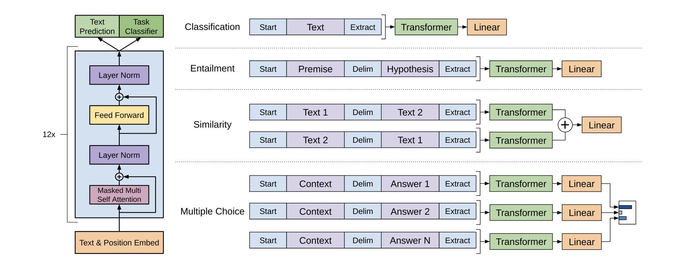

# AI 大模型的运行逻辑<Badge type="tip" text="阅读时长 15-30 分钟" />

&emsp;&emsp;AI 大模型，如 OpenAI 的 GPT-3 和 GPT-4，以及其他类似的预训练模型，是通过大量数据和计算资源进行训练的。这些模型基于 Transformer 架构，具有数亿甚至数千亿的参数。本章将向您介绍 AI 大模型的运行逻辑，包括模型训练过程、模型架构、以及预训练和微调的概念。我们将通过生活场景上的比喻和示意图来解释相关概念，以便于您更好地理解。

## 模型训练过程

&emsp;&emsp;训练 AI 大模型的过程可以类比于教育人类的过程。当一个孩子在成长过程中，他们需要学习语言、知识、技能等。通过大量阅读、听、说、写等活动，孩子们能够掌握这些知识。类似地，AI 大模型在训练过程中会学习大量的文本数据，从而掌握自然语言处理（NLP）任务所需的知识。

GPT3.5 训练策略[1]

## Transformer 架构

&emsp;&emsp;Transformer 架构是 AI 大模型的基础。它是一种特殊的神经网络架构，可以处理大量并行计算任务，从而在自然语言处理领域取得了显著的成果。您可以将 Transformer 架构想象成一个高效的生产线，它可以在短时间内处理大量的文本信息。

Transform 模型架构[2]

## 预训练与微调

&emsp;&emsp;AI 大模型通常分为两个阶段进行训练：预训练和微调。预训练阶段相当于一个孩子在阅读大量书籍，从中学习语言和知识。在这个阶段，模型学习词汇、语法、句子结构等基本知识。而微调阶段则类似于为孩子量身定制的辅导课程，使他们能够专注于特定的任务或领域。在这个阶段，模型通过针对特定任务的数据集进行训练，以便更好地完成该任务。

【左】transform 架构和训练目标，【右】对于不同任务的微调 [3]

&emsp;&emsp;通过预训练和微调的过程，AI 大模型能够更好地理解和生成自然语言。在实际应用中，这使得 AI 大模型能够完成各种任务，如文本生成、摘要、翻译、情感分析等。

## 语言模型和生成任务

&emsp;&emsp;AI 大模型的主要任务之一是生成任务。简单地说，生成任务就是根据给定的输入，生成与之相关的输出文本。例如，根据一个问题生成相应的答案，或根据一段描述生成相关的文章。生成任务可以类比为一个作家创作故事，他根据故事的开头、角色和背景等信息，创作出一篇完整的故事。

## 小结

&emsp;&emsp;通过本章的学习，您应该已经对 AI 大模型的运行逻辑有了基本的了解。在接下来的章节中，我们将进一步深入讨论与 Prompt Engineering 相关的概念和技巧。

## 参考文献

[1] https://openai.com/blog/chatgpt 
[2] Vaswani A, Shazeer N, Parmar N, et al. Attention is all you need[J]. Advances in neural information processing systems, 2017, 30. 
[3] Radford A, Narasimhan K, Salimans T, et al. Improving language understanding by generative pre-training[J]. 2018. 
