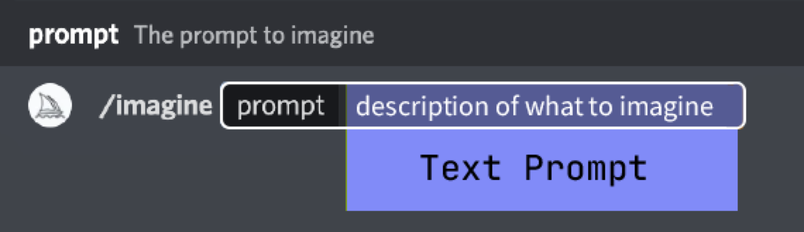
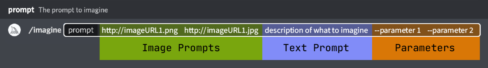

# Midjourney<Badge type="tip" text="阅读时长 15-25 分钟" />

&emsp;&emsp;在本章节中，我们将介绍 Midjourney 的语法格式，以便更好地利用 Midjourney 的潜力。

> 提示是一个简短的文本短语，Midjourney 机器人会对其进行解释以生成图像。Midtravel Bot 将提示中的单词和短语分解为更小的片段，称为令牌，可以将其与训练数据进行比较，然后用于生成图像。精心制作的提示可以帮助制作独特而令人兴奋的图像。 —— Midjourney

## 基础结构

&emsp;&emsp;基本提示可以简单到单个单词、短语或 emoji🎉

## 高级结构

&emsp;&emsp;更高级的提示可以包括一个或多个图像 URL、多个文本短语和一个或多个参数。

- Image Prompt —— 可以将图像 URL 添加到提示中，以影响最终结果的样式和内容。图像 URL 总是位于提示的前面。（也被称作垫图）
- Text Prompt —— 要生成的图像的文本描述。
- Parameters —— 参数会更改图像的生成方式。参数可以改变纵横比、模型、放大倍数等等。参数位于提示的末尾。[MJ Parameters](https://docs.midjourney.com/parameter-list)

## Prompt 长度

&emsp;&emsp;提示可以非常简单。单个单词（甚至一个 emoji😈！）会产生一个图像。非常短的提示将在很大程度上依赖于 Midtravel 的默认样式，因此更具描述性的提示更适合独特的外观。然而，超长提示并不总是更好的。专注于你想要创造的主要概念。

## 语法

&emsp;&emsp;Midjourney 机器人不能像人类一样理解语法、句子结构或单词。单词的选择也很重要。在许多情况下，更具体的同义词效果更好。例如: 尝试用 `gigantic`, `enormous`, 或者 `immense` 来替代 `big`。尽可能删除单词。更少的单词意味着每个单词都有更强大的权重。使用逗号、括号和连字符来帮助组织你的想法，但要知道 Midjourney 机器人不会可靠地解释它们。

## 小结

&emsp;&emsp;在本章节中，我们探讨了如何利用 Midjourney 生成图像。为了更好地使用 Midjourney，您需要了解其语法和结构。以下是本章节的主要内容概述：

- 基础结构：基本提示可以简单到单个单词、短语或 emoji，这些提示足以生成图像。

- 高级结构：更复杂的提示可以包括一个或多个图像 URL、多个文本短语和一个或多个参数。图像 URL 用于影响生成结果的样式和内容；文本提示描述要生成的图像；参数可以更改图像的生成方式，例如纵横比、模型和放大倍数等。

- Prompt 长度：尽管简短的提示依赖于 Midjourney 的默认样式，但更具描述性的提示可以产生更独特的外观。然而，超长提示并不总是更好，应专注于要创建的主要概念。

- 语法：Midjourney 机器人不能像人类一样理解语法、句子结构或单词。在选择单词时，更具体的同义词通常效果更好。尽可能减少单词数量，以增加每个单词的权重。使用逗号、括号和连字符来组织想法，但要知道 Midjourney 机器人可能无法可靠地解释它们。

&emsp;&emsp;通过了解 Midjourney 的语法和结构，您将能够更有效地使用此工具生成满足需求的图像。不断实践和尝试将有助于您更快地掌握这些技巧，并发挥 AI 的最大潜力。
