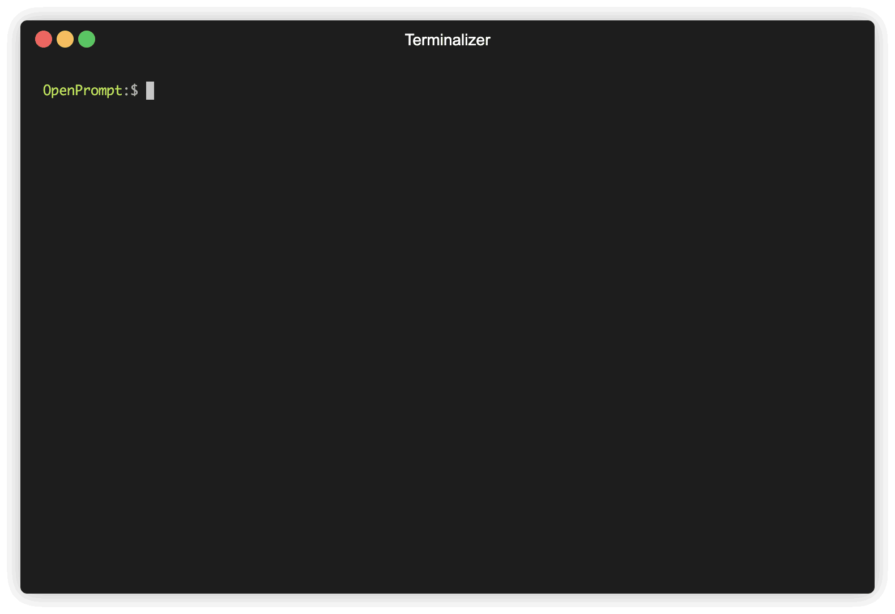

<div align="center">


**一个用于 Prompt-learning 的开源框架。**

[Github Repo](https://github.com/thunlp/OpenPrompt)

---

<p align="center">
  <a href="#Overview">概述</a> •
  <a href="#installation">安装</a> •
  <a href="#use-openprompt">如何使用</a> •
  <a href="https://thunlp.github.io/OpenPrompt/">文档</a> •
  <a href="https://arxiv.org/abs/2111.01998">论文</a> •
  <a href="#citation">引用</a> •
  <a href="https://github.com/thunlp/OpenPrompt/tree/main/results/">性能</a> •
</p>

</div>


## 新功能有哪些？

- ❗️ 2023 年 4 月: $\color{red}{\normalsize{\textbf{想要构建自己的聊天AI吗？}}}$ **我们正在发布 [UltraChat](https://github.com/thunlp/UltraChat), 使用 OpenPrompt 和 UltraChat 进行有监督指导调整, 参见** [`./tutorial/9_UltraChat.py`](./tutorial/9_UltraChat.py).
- 2022 年 8 月: 感谢贡献者 [zhiyongLiu1114](https://github.com/zhiyongLiu1114), OpenPrompt 现在支持 [ERNIE 1.0](https://github.com/thunlp/OpenPrompt/tree/main/tutorial/7_ernie_paddlepaddle) 在 飞浆 PaddlePaddle.
- 2022 年 7 月: OpenPrompt 现在支持 OPT。
- 2022 年 6 月: OpenPrompt 获得 ACL 2022 最佳演示论文奖。
- 2022 年 3 月: 我们添加了一个 [教程](https://github.com/thunlp/OpenPrompt/blob/main/tutorial/6.1_chinese_dataset_uer_t5.py) 作为对 [问题 124](https://github.com/thunlp/OpenPrompt/issues/124), 的回应，该教程使用自定义的 tokenizer_wrapper 来执行 OpenPrompt 默认配置中没有的任务（例如 Bert tokenizer+T5 模型）。
- 2022 年 2 月: 请查看我们的姐妹仓库 [OpenDelta](https://github.com/thunlp/OpenDelta)!
- 2021 年 12 月: `pip install openprompt`
- 2021 年 12 月: 添加了 [SuperGLUE performance](https://github.com/thunlp/OpenPrompt/tree/main/results)
- 2021 年 12 月: 我们通过添加新的 Verbalizer [GenerationVerbalizer](https://github.com/thunlp/OpenPrompt/blob/main/openprompt/prompts/generation_verbalizer.py) 和一个 [教程: 4.1_all_tasks_are_generation.py](https://github.com/thunlp/OpenPrompt/blob/main/tutorial/4.1_all_tasks_are_generation.py)支持了**所有任务的生成范式**
- 2021 年 11 月: 我们发布了一篇论文 [OpenPrompt: An Open-source Framework for Prompt-learning](https://arxiv.org/abs/2111.01998).
- 2021 年 11 月: PrefixTuning 现在支持 t5。
- 2021 年 11 月: 我们对上一个版本进行了一些重大更改，引入了一种灵活的模板语言！部分文档已过时，我们将尽快修复。

## 概述

**Prompt-learning** 是将预训练语言模型（PLMs）应用于下游自然语言处理任务的最新范式。它通过使用文本模板修改输入文本，并直接使用 PLMs 来进行预测。OpenPrompt 是一个提供标准、灵活和可扩展的框架，用于部署 **Prompt-learning** 流程。OpenPrompt 支持直接从 [huggingface transformers](https://github.com/huggingface/transformers) 加载 PLMs。未来，我们还将支持其他库实现的 PLMs。有关 Prompt 学习的更多资源，请查看我们的[论文列表](https://github.com/thunlp/PromptPapers)。

<div align="center">


</div>

## 通过 OpenPrompt，您可以做以下事情：



- 使用当前的 prompt-learning 实现.\* 我们已经实现了各种提示方法，包括模板化、口述和优化策略，统一标准下的方法。您可以轻松调用和理解这些方法.
- _Design your own prompt-learning work._ With the extensibility of OpenPrompt, you can quickly practice your prompt-learning ideas.

## 安装说明：

**注意：请使用 Python 3.8+ 版本进行安装 OpenPrompt。**

### 使用 Pip 安装

我们的存储库在 Python **3.8+** 和 PyTorch **1.8.1+** 上进行了测试，您可以使用以下命令通过 pip 安装 OpenPrompt：

```shell
pip install openprompt
```

要使用最新功能，您还可以从源代码安装 OpenPrompt。

### 使用 Git

从 GitHub 克隆代码库：

```shell
git clone https://github.com/thunlp/OpenPrompt.git
cd OpenPrompt
pip install -r requirements.txt
python setup.py install
```

修改代码

```
python setup.py develop
```

## 使用 OpenPrompt

### 基本概念

一个 `PromptModel` 对象包含一个 `PLM`，一个（或多个）`Template` 和一个（或多个）`Verbalizer`。其中，`Template` 类用于将原始输入用模板包装起来，而 `Verbalizer` 类用于在当前词汇表中构建标签和目标词之间的映射。一个 `PromptModel` 对象在训练和推理过程中发挥作用。

### 通过简单示例介绍

借助 OpenPrompt 的模块化和灵活性，您可以轻松开发一个 prompt 学习的流程。

#### 第一步：定义任务

第一步是确定当前的 NLP 任务，思考您的数据是什么样的，以及您对数据有什么要求！换句话说，这一步的核心是确定任务的类别和 InputExample。为了简单起见，我们以情感分析为例进行说明。tutorial_task.

```python
from openprompt.data_utils import InputExample
classes = [ # There are two classes in Sentiment Analysis, one for negative and one for positive
    "negative",
    "positive"
]
dataset = [ # For simplicity, there's only two examples
    # text_a is the input text of the data, some other datasets may have multiple input sentences in one example.
    InputExample(
        guid = 0,
        text_a = "Albert Einstein was one of the greatest intellects of his time.",
    ),
    InputExample(
        guid = 1,
        text_a = "The film was badly made.",
    ),
]
```

#### 第二步：选择预训练语言模型（PLMs）作为基础

选择一个 PLM 来支持您的任务。不同的模型具有不同的特性，我们鼓励您使用 OpenPrompt 来探索各种 PLMs 的潜力。OpenPrompt 兼容[huggingface](https://huggingface.co/transformers/)上的模型。

```python
from openprompt.plms import load_plm
plm, tokenizer, model_config, WrapperClass = load_plm("bert", "bert-base-cased")
```

#### 第三步：定义模板

`Template` 是对原始输入文本的修改器，也是 prompt 学习中最重要的模块之一。
我们在第一步中已经定义了 `text_a`。

```python
from openprompt.prompts import ManualTemplate
promptTemplate = ManualTemplate(
    text = '{"placeholder":"text_a"} It was {"mask"}',
    tokenizer = tokenizer,
)
```

#### 第四步：定义 Verbalizer

`Verbalizer`是 prompt 学习中的另一个重要模块（但不是必需的），它将原始标签（我们已经将它们定义为`classes`，记得吗？）投射到一组标签词上。以下是一个示例，我们将`negative`类投射到单词 bad 上，将`positive`类投射到 good、wonderful、great 等词上。

```python
from openprompt.prompts import ManualVerbalizer
promptVerbalizer = ManualVerbalizer(
    classes = classes,
    label_words = {
        "negative": ["bad"],
        "positive": ["good", "wonderful", "great"],
    },
    tokenizer = tokenizer,
)
```

#### 第五步：将它们组合成 PromptModel

根据任务，现在我们有了一个`PLM`、一个`Template`和一个`Verbalizer`，我们将它们组合成一个`PromptModel`。请注意，虽然示例中简单地将这三个模块组合在一起，但实际上您可以定义它们之间的一些复杂交互作用。

```python
from openprompt import PromptForClassification
promptModel = PromptForClassification(
    template = promptTemplate,
    plm = plm,
    verbalizer = promptVerbalizer,
)
```

#### 第六步：定义 DataLoader

`PromptDataLoader`基本上是 pytorch Dataloader 的 prompt 版本，它还包括一个`Tokenizer`、一个`Template`和一个`TokenizerWrapper`。

```python
from openprompt import PromptDataLoader
data_loader = PromptDataLoader(
    dataset = dataset,
    tokenizer = tokenizer,
    template = promptTemplate,
    tokenizer_wrapper_class=WrapperClass,
)
```

#### 第七步：训练和推理

完成了！我们可以像在 PyTorch 中进行其他过程一样进行训练和推理。

```python
import torch

# 使用预训练的MLM模型进行零样本推理，利用提示信息。
promptModel.eval()
with torch.no_grad():
    for batch in data_loader:
        logits = promptModel(batch)
        preds = torch.argmax(logits, dim = -1)
        print(classes[preds])
# 预测结果为1和0，分别代表类别“积极”和“消极”。
```

请参考我们的[教程脚本](https://github.com/thunlp/OpenPrompt/tree/main/tutorial)和[文档](https://thunlp.github.io/OpenPrompt/)以获取更多详细信息。

## 数据集

我们在`dataset/`文件夹中提供了一系列的下载脚本，您可以随意使用它们来下载基准数据集。

## 性能报告

由于 OpenPrompt 提供了太多可能的组合方式，我们正在尽力测试不同方法的性能。性能数据将会不断更新在[表格](https://github.com/thunlp/OpenPrompt/tree/main/results/)中。我们也鼓励用户寻找适合自己任务的最佳超参数，并通过提交拉取请求的方式报告结果。

## 已知问题

未来的主要改进/增强。

- 我们对上一个版本进行了一些重大更改，因此部分文档已过时。我们将尽快修复。

## 引用

如果您在工作中使用了 OpenPrompt，请引用我们的论文。

```bibtex
@article{ding2021openprompt,
  title={OpenPrompt: An Open-source Framework for Prompt-learning},
  author={Ding, Ning and Hu, Shengding and Zhao, Weilin and Chen, Yulin and Liu, Zhiyuan and Zheng, Hai-Tao and Sun, Maosong},
  journal={arXiv preprint arXiv:2111.01998},
  year={2021}
}
```

## 贡献者

<!-- 复制粘贴到您的 Readme.md 文件中 -->

<a href="https://github.com/thunlp/OpenPrompt/graphs/contributors">
  
</a>

我们感谢所有对这个项目做出贡献的人，欢迎更多的贡献者加入！
